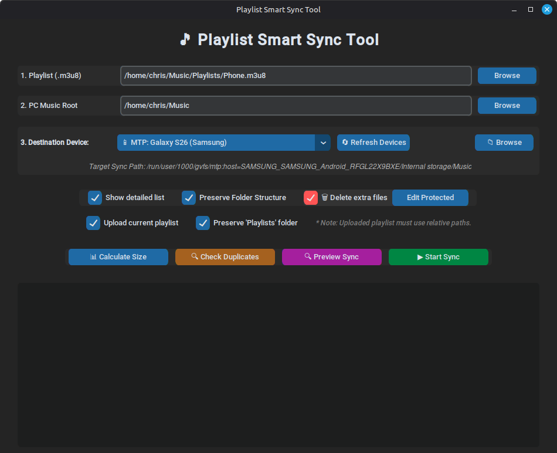
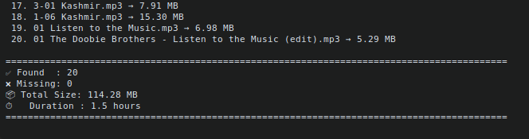
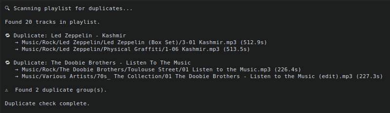
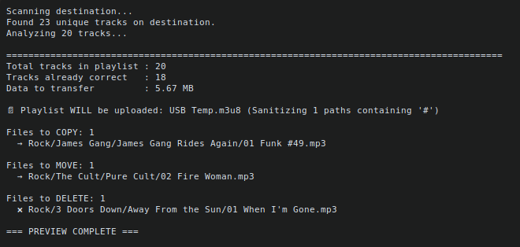

# 🎵 Playlist Smart Sync Tool

A robust, graphical local synchronization tool designed to bridge the gap between desktop music management and Android/MTP devices. Specifically engineered and optimized for **Linux Mint** and environments leveraging the GNOME Virtual File System (GVFS).



The **Playlist Smart Sync Tool** analyzes local `.m3u8` playlists, calculates differential sync paths, automatically escapes unsafe control characters that break mobile media players, and accurately mirrors your music collection onto external storage or phone partitions without file system locks.

---

## 🚀 Features

* **Intelligent Pathfinding (`find_media_root`):** Automatically maps base mount points to the correct inner Android directory structures (e.g., `Internal storage/Music`, `SD Card/Audio`).
* **Differential Multi-Action Evaluation:** Calculates what needs to be changed instantly upfront, grouping execution routines into distinct lists (`to_copy`, `to_move`, `to_remove`).
* **Dry-Run Preview Execution:** Implements a consolidated single-algorithm system architecture, ensuring that your **Preview Sync** and **Start Sync** are mathematically guaranteed to match.
* **On-the-Fly Path Sanitization:** Scans file titles like *"Funk #49"* or complex album paths containing reserved control characters (`#`), automatically translating them to web-safe URL strings (`%23`) during the playlist deployment to prevent mobile media player parsing dropouts. *Note: If enabled, this playlist sanitization and upload process executes seamlessly on every sync deployment, updating your device playlist even if zero audio files require copying or moving.*
* **Smart System-Aware Cleanups:** Implements an aggressive bottom-up cleanup of empty target folders while strictly preserving system-critical files, directories, and hidden directories like `.thumbnails/` or custom `Playlists/` storage.
* **Desktop Integration:** Features an automatic icon installation routine that deploys application branding assets directly into your system user profile.
* **Automated Asset Deployment:** Features a self-initializing startup script that copies structural icon graphics into your desktop profile path the very first time the app is run.

---

## 🐧 Designed for Linux

This utility is explicitly built around native Linux file handles and virtual tracking daemons. It relies on the **GNOME Virtual File System (GVFS)** to smoothly handle Media Transfer Protocol (MTP) data channels. 

File actions are delegated to sub-processes executing native `gio` backend routines (`gio copy`, `gio move`, `gio remove`). This bypasses the typical permission lockups, strict file-system constraints, and operational crashes encountered when standard Python I/O modules interact directly with unmapped Android mount partitions.

---

## 📂 Project Structure

Your repository should look like this (excluding local runtime caches or hidden local configuration trees):

```text
Playlist_Sync_Tool/
├── icons/
│   └── hicolor/
│       ├── 256x256/
│       │   └── apps/
│       │       └── playlist-sync-tool.png
│       └── 48x48/
│           └── apps/
│               ├── Playlist-Sync-Tool_Gray.png
│               └── Playlist-Sync-Tool.png
├── ScreenShots/
│   ├── Calc_Size.png
│   ├── Check_Duplicates.png
│   ├── Playlist_Sync_Tool.png
│   └── Preview_Sync.png
├── .gitignore
├── Playlist-Sync-Tool.desktop
├── Playlist_Sync_Tool.py
├── requirements.txt
├── README.md
└── LICENSE
```

## 🛠️ Installation & Setup (Using a Virtual Environment)
Ensure your system package manager has the underlying Python development libraries and MTP virtual file managers installed:

```bash
sudo apt update
sudo apt install python3-venv python3-pip gio-bin libglib2.0-bin python3-tk
```
Follow these containment steps inside your project workspace folder to launch the tool safely:

### 1. Set Up and Activate the Environment

```bash
# Navigate to your cloned workspace directory
cd Playlist_Sync_Tool

# Establish an isolated local virtual environment
python3 -m venv .venv

# Activate the workspace sandbox
source .venv/bin/activate
```

### 2. Install Project Dependencies
Use pip to pull down the necessary external graphical and structural libraries inside your active .venv:

```bash
pip install -r requirements.txt
```
(Your requirements.txt should contain: customtkinter, ctkmessagebox3, and mutagen)

### 3. First-Run Run Execution (Automated Icon Installation)
Launch the tool inside your active terminal session:

💡 First-Run Behavior: On this first launch, the program automatically registers its brand assets by checking your system environment and copying the application graphics bundle out of ./icons/ and directly into your user's local path (~/.local/share/icons/hicolor/).

```Bash
python3 Playlist_Sync_Tool.py
```
### 4. Optional: Desktop Application Menu Integration
To launch the tool directly from your Linux Mint system Application Menu without using a terminal:

1. Open the included desktop entry shortcut file (Playlist-Sync-Tool.desktop) in a text editor.

2. Modify the Exec= path to reference your specific user directory name, replacing chris with your system account name:
```Ini, TOML
Exec=/home/YOUR_USERNAME/Projects/Playlist_Sync_Tool/.venv/bin/python3 /home/YOUR_USERNAME/Projects/Playlist_Sync_Tool/Playlist_Sync_Tool.py
```
_(Note: Linux desktop entry standards do not support path expansions like `~/` or `$HOME` here; hardcoded absolute system paths must be explicitly provided)._

3. Deploy the modified configuration shortcut to your desktop runtime layer:

```Bash
cp Playlist-Sync-Tool.desktop ~/.local/share/applications/
```
### 📋 Dependencies
1. The application leverages the Python Standard Library alongside three crucial community packages:

2. __`customtkinter:`__ Powers the responsive, modern UI layout grids, dark color themes, and widget geometries.

3. __`ctkmessagebox3:`__ Manages parent-locked structural pop-ups, confirmation dialogs, and error alerts.

4. __`mutagen:`__ Interrogates target file metadata dynamically to analyze audio properties and extract track lengths.

### 📖 Usage Instructions
1. __Select Playlist:__ Click Browse next to section 1 to choose your source relative-path .m3u8 playlist file.

2. __Set PC Music Root:__ Identify your master local storage parent folder (e.g., /home/user/Music).

3. __Map Destination Device:__ Use Refresh Devices to scan GVFS mounts automatically, select your device from the dropdown, or hit Browse Manually to map an explicit point.

4. Choose Synchronization Options:

    * __Show detailed list:__ Toggles verbose logging for individual tracking items.

    * __Preserve Folder Structure:__ Retains the exact subfolder hierarchies.

    * __Delete extra files:__ Enables purging files from the target directory that aren't defined in the active playlist.

    * __Upload current playlist:__ Compiles and safely uploads a sanitized .m3u8 copy straight onto your device's Playlists/ folder. Note: This routine executes independently at the end of the deployment cycle; checking this box guarantees your device playlist is freshly rewritten and updated even if no music tracks are transferred.

5. __Run Analysis:__ Click Calculate Size, Check Duplicates, or Preview Sync to print reports without altering any files.

6. __Deploy:__ Click Start Sync to execute your file operations.

### Screenshots
#### Calculate Size

#### Check Duplicates

#### Preview Sync



### 📄 License
This project is licensed under the terms of the [LICENSE](LICENSE).
``` text
MIT License

Copyright (c) 2026 Chris Smith

Permission is hereby granted, free of charge, to any person obtaining a copy
of this software and associated documentation files (the "Software"), to deal
in the Software without restriction, including without limitation the rights
to use, copy, modify, merge, publish, distribute, sublicense, and/or sell
copies of the Software, and to permit persons to whom the Software is
furnished to do so, subject to the following conditions:

The above copyright notice and this permission notice shall be included in all
copies or substantial portions of the Software.

THE SOFTWARE IS PROVIDED "AS IS", WITHOUT WARRANTY OF ANY KIND, EXPRESS OR
IMPLIED, INCLUDING BUT NOT LIMITED TO THE WARRANTIES OF MERCHANTABILITY,
FITNESS FOR A PARTICULAR PURPOSE AND NONINFRINGEMENT. IN NO EVENT SHALL THE
AUTHORS OR COPYRIGHT HOLDERS BE LIABLE FOR ANY CLAIM, DAMAGES OR OTHER
LIABILITY, WHETHER IN AN ACTION OF CONTRACT, TORT OR OTHERWISE, ARISING FROM,
OUT OF OR IN CONNECTION WITH THE SOFTWARE OR THE USE OR OTHER DEALINGS IN THE
SOFTWARE.
```

### 🤝 Acknowledgments & Credits
* __Chris Smith:__ Creator, lead developer, designer, and primary tester.
Drove the entire project from a simple playlist size calculator into a full-featured, polished smart sync tool with device detection, protected file handling, duplicate detection, and clean folder management.

* __Grok (xAI):__ Long-term collaborator across the entire development process. Provided initial architecture, extensive debugging, path resolution logic, smart sync engine (preview + actual sync with move/rename awareness), duplicate detection, protected file handling, empty folder cleanup, and iterative refinement of the user interface.

* __Gemini (Google):__ Refactored the core synchronization model into a unified single-pass calculation algorithm, resolved scope boundaries and positional argument anomalies, refactored bottom-up system directory exclusions, and engineered the automated relative playlist URL sanitization routine.

Special Thanks to the maintainers of:

* __`CustomTkinter`__ — for the beautiful modern UI
* __`ctkmessagebox3`__ — for the clean custom message boxes
* __`Mutagen`__ — for robust audio metadata handling

For providing the core libraries that make this utility streamlined, efficient, and visually polished.